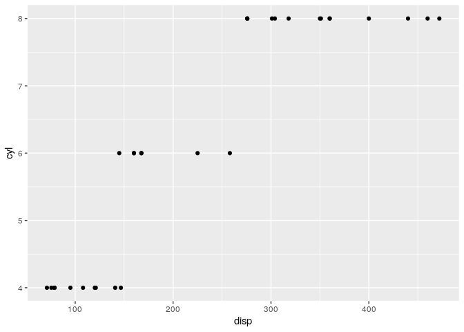

# SHINY MASTERCLASS BY APPSILON

## THEMING

-   bslib: rstudio.github.io/balib: Simpler theming of web content
-   thematic: rstudio.github.io/thematic: Simpler theming of ggplots and
    other plots

``` r
library(shiny)
# Kind of replaces shiny themes
library(bslib)
# Use themes also in R graphics
library(ggplot2)
```

Pseudocode

``` r
# Now
ui <- fluidPage(
  theme = bs_theme(version  = 4), 
  ...
)

# before
```

Preview themes with

``` r
bs_theme_preview(
  bs_theme(bootswatch = "solar")
)
```

``` r
# For shiny apps
thematic::thematic_shiny()

# For anything globally
thematic::thematic_on(
  # "auto" automatically detects shiny settings or rstudio settings
  font = "auto"
)
```

``` r
thematic::thematic_on(
  # Instead of "auto" it could be a google font and it will be downloaded
  font = "Indie Flower"
)

ggplot(mtcars, aes(disp, cyl)) + 
  geom_point()
```

    ## Warning: thematic was unable to resolve `bg='auto'`. Try providing an actual
    ## color (or `NA`) to the `bg` argument of `thematic_on()`. By the way, 'auto' is
    ## only officially supported in `shiny::renderPlot()`, some rmarkdown scenarios
    ## (specifically, `html_document()` with `theme!=NULL`), in RStudio, or if
    ## `auto_config_set()` is used.

    ## Warning: thematic was unable to resolve `fg='auto'`. Try providing an actual
    ## color (or `NA`) to the `fg` argument of `thematic_on()`. By the way, 'auto' is
    ## only officially supported in `shiny::renderPlot()`, some rmarkdown scenarios
    ## (specifically, `html_document()` with `theme!=NULL`), in RStudio, or if
    ## `auto_config_set()` is used.

    ## Warning: thematic was unable to resolve `accent='auto'`. Try providing an
    ## actual color (or `NA`) to the `accent` argument of `thematic_on()`. By the way,
    ## 'auto' is only officially supported in `shiny::renderPlot()`, some rmarkdown
    ## scenarios (specifically, `html_document()` with `theme!=NULL`), in RStudio, or
    ## if `auto_config_set()` is used.

    ## Error : The fig.showtext code chunk option must be TRUE

<!-- -->

## SASS

``` r
# example @spartuga Pedro Silva
sass::sass()
```

## Speeting up

### Update functions

You may use `checkbotInput()` and `outputUI()` and no `update*()`; but
each time the output changes shiny recomputes lots of stuff – it has to
rebuild the whole structure.

Better is to use `updateSelectInput()` inside `observeEvent()`. This way
shiny updates one specific element only and reuses existing bindings.

### Proxy wiedgts

Similar to `update*()` functions but useful for more complex stuff like
DT tables.

``` r
output$table <- DT::renderDataTable(irig)
dataTableProxy("table")
```

Learn the family of proxy functions that exist. If it doesn’t exist, you
can create it.

### Custom messages and brower offloading

``` r
# in R
sendCustomMessage()
# in JavaScript
Shiny.addCustomMessageHandler()
Shiny.onInputChange()
```

For examples, see Pedro Silva’s shiny contest entry.

This is a mechanism to pass things from R to the browser and back (via
JavaScript). It allows you, for example, to reuse JavaSript in shiny.

It’s useful to learn the basics of JavaScript.

### Shiny extensions

See github.com/nanxstats/awesome-shiny-extensions

-   ShinyJS
-   ShinyWidgets
-   shinycssloaders::withSpinner()
-   bs4Dash
-   shinyMobile
-   shiny.semantic and other packages shiny.\* by Appsilon (see
    <http://shiny.tools/>)

### Learning

-   See apps by daattali
-   See apps by Pedro Silva

### Best practices

-   modules
-   R6
-   wahani modules: wahani.github.io/modules

Organize development envirionment:

-   lintr
-   test
-   PR template
-   github templates

Recommended environmet:

-   rstudio running on docker and using renv + github CI
-   or rstudio server + renv + github CI

Testing and tools

The testing piramid

1.  Unit tests with testthat
2.  data validation with assertr and create reoprts with rstudio connect
    scheduler – great for a ds-incubator demo
3.  end-to-end with Shinytest or Cypress for more complex apps (needs
    JavaScript skills)
4.  shiny loadtest to test traffic
5.  Usability
